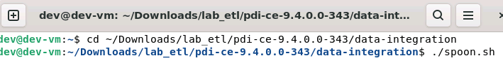
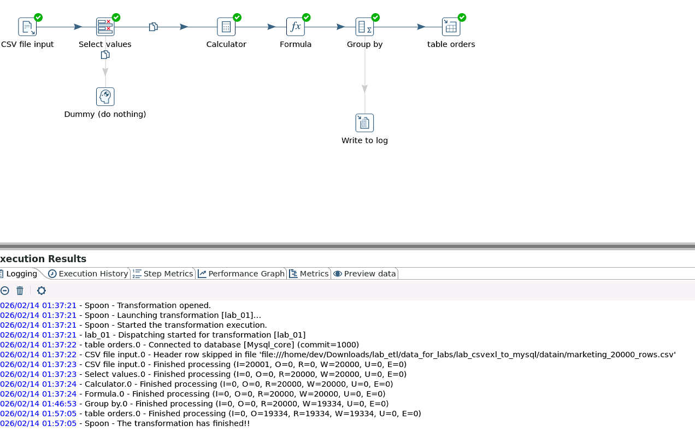
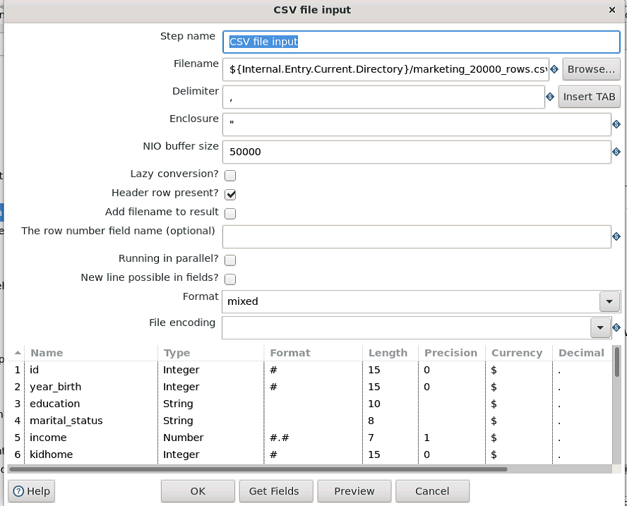
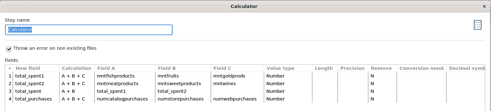
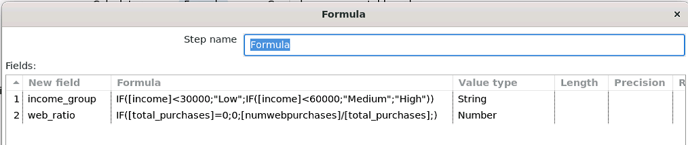
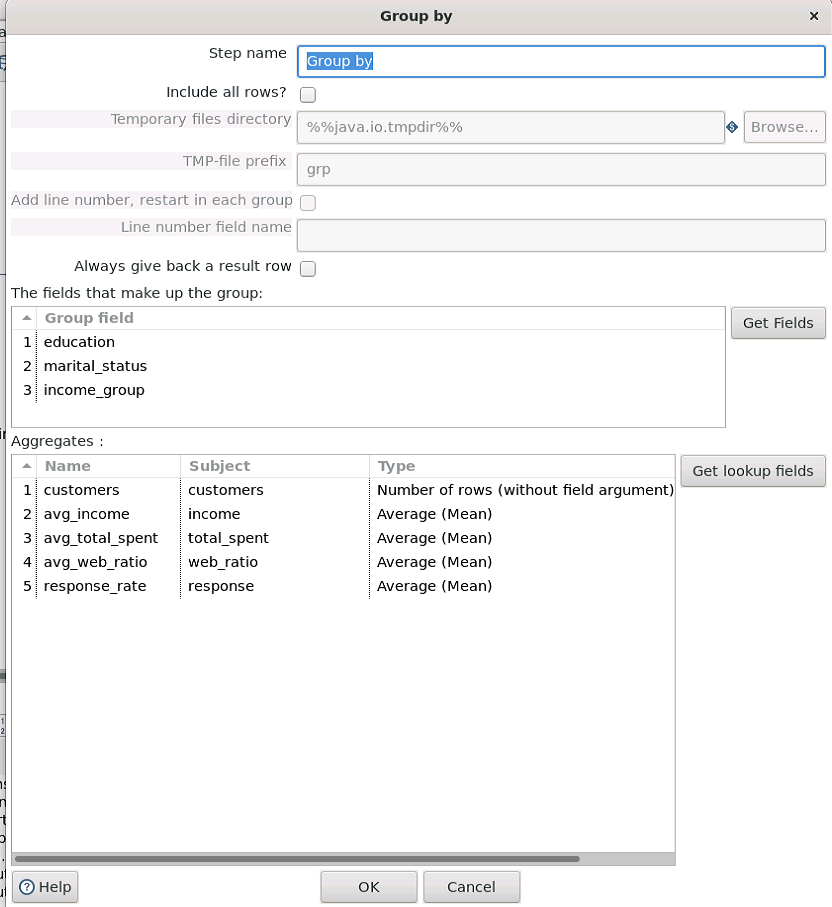
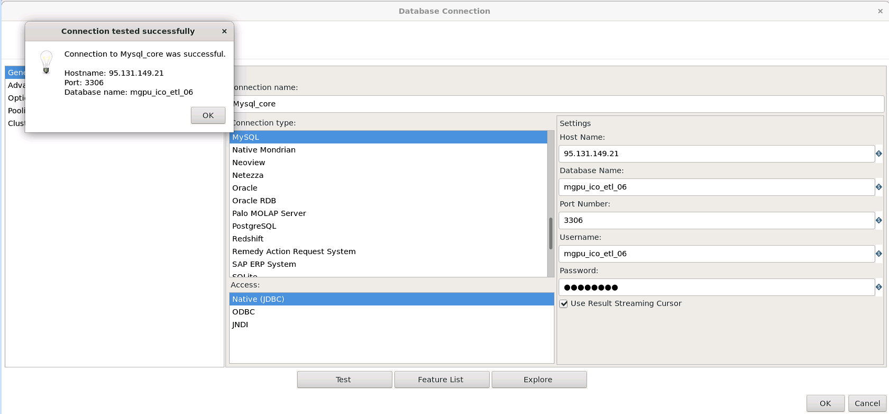
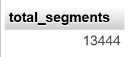
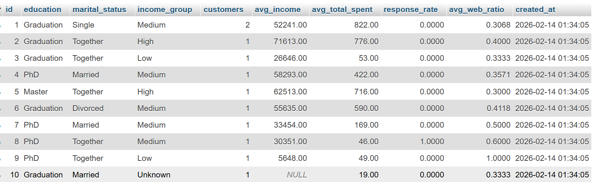
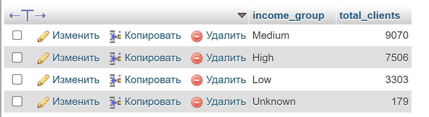

# Лабораторная работа 1.1  
## Установка и настройка ETL-инструмента. Создание конвейеров данных

**Вариант №6 — Маркетинг: анализ эффективности рекламных кампаний**

*Цель работы:* изучить основные принципы работы с ETL-инструментами на примере **Pentaho Data Integration (PDI)**:  
настроить среду выполнения, создать конвейер обработки данных (очистка, фильтрация, преобразование) и загрузить результаты в базу данных **MySQL**.
### Описание входных данных
Использован датасет маркетинговых кампаний (CSV-файл), содержащий информацию об эффективности рекламы. Ссылка на датасет: https://www.kaggle.com/datasets/rodsaldanha/arketing-campaign

Добавлены [данные](/practice/lw_01/marketing_20000_rows.csv) для увеличения количества строк - до 20 000 записей

| Поле | Описание |
|------|----------|
| ID | Уникальный идентификатор клиента |
| Year_Birth | Год рождения клиента |
| Education | Уровень образования |
| Marital_Status | Семейное положение |
| Income | Годовой доход семьи |
| Kidhome | Количество маленьких детей |
| Teenhome | Количество подростков |
| Dt_Customer | Дата регистрации клиента |
| Recency | Дней с последней покупки |
| MntWines | Расходы на вино (2 года) |
| MntFruits | Расходы на фрукты |
| MntMeatProducts | Расходы на мясные продукты |
| MntFishProducts | Расходы на рыбу |
| MntSweetProducts | Расходы на сладости |
| MntGoldProds | Расходы на золотые товары |
| NumDealsPurchases | Покупки со скидкой |
| NumWebPurchases | Онлайн-покупки |
| NumCatalogPurchases | Покупки по каталогу |
| NumStorePurchases | Покупки в магазине |
| NumWebVisitsMonth | Посещения сайта за месяц |
| AcceptedCmp1–5 | Принятие предложения в кампаниях 1–5 |
| Complain | Жалобы за последние 2 года |
| Z_CostContact | Стоимость контакта |
| Z_Revenue | Доход |
| Response | Принятие предложения в последней кампании |

---
## Запуск Pentaho Spoon

***

## Скриншот конвейера в Spoon

***

###  Ключевые шаги

**CSV File Input**  


**Calculator**  


**Formula**  


**Group by**  


**Table Output - подключение к БД**  


---
### SQL-запросы для проверки загрузки данных 
```sql
SELECT COUNT(*) AS total_segments
FROM customer_segment_summary;
```

```sql
SELECT *
FROM customer_segment_summary
LIMIT 10;
```

```sql
SELECT income_group, SUM(customers) AS total_clients
FROM customer_segment_summary
GROUP BY income_group;
```

***

### [Файл трансформации](/lw_01/lab_01.ktr)

### Выводы
В ходе работы была настроена среда для выполнения ETL-процессов и успешно запущен Pentaho Data Integration. Создана трансформация, реализующая полный цикл обработки данных: чтение CSV-файла, очистка и преобразование данных, загрузка результатов в MySQL. Корректность загрузки подтверждена SQL-запросами. Цель лабораторной работы достигнута.
