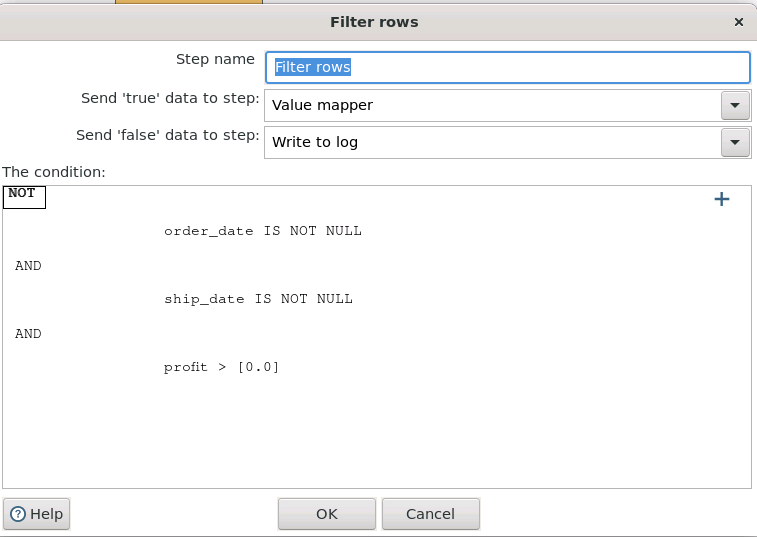
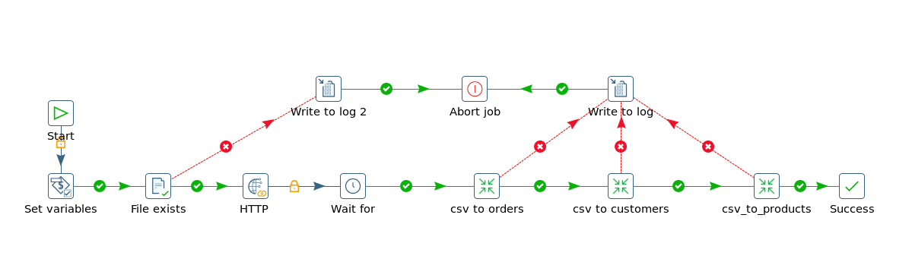
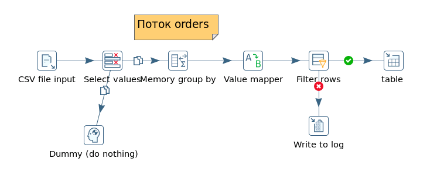
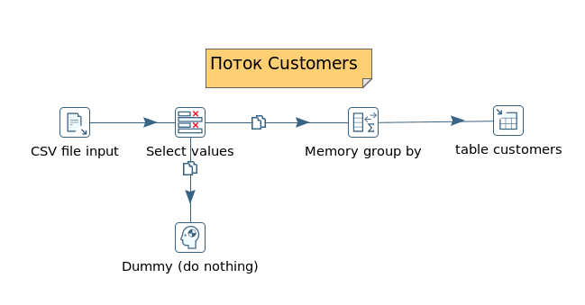
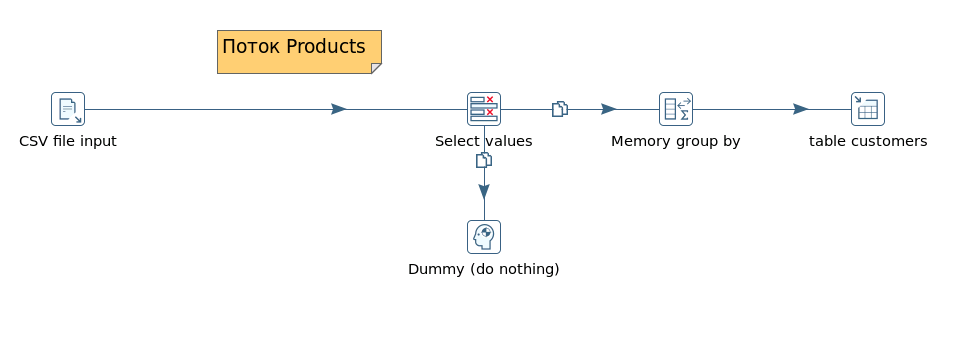
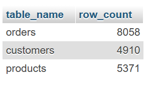
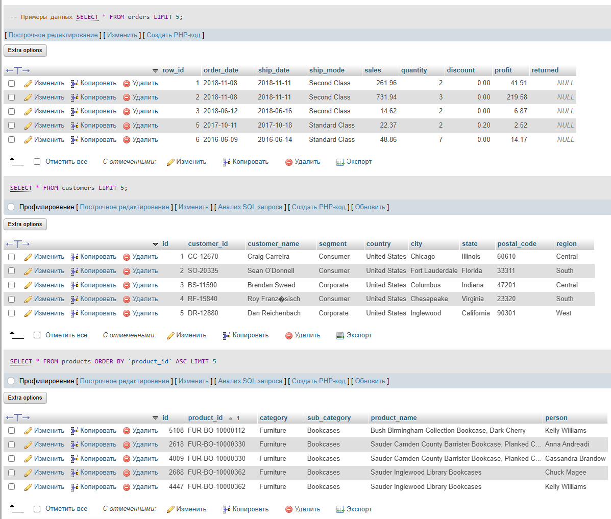
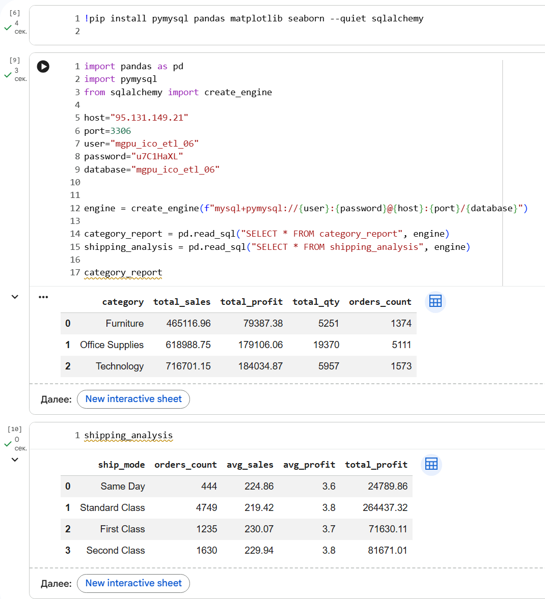
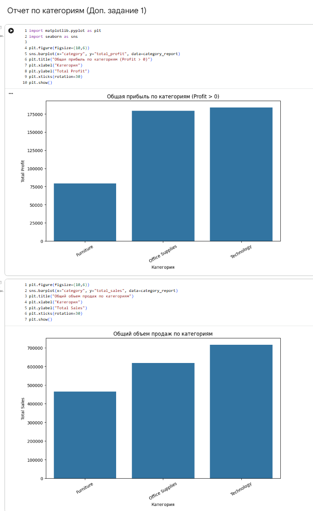
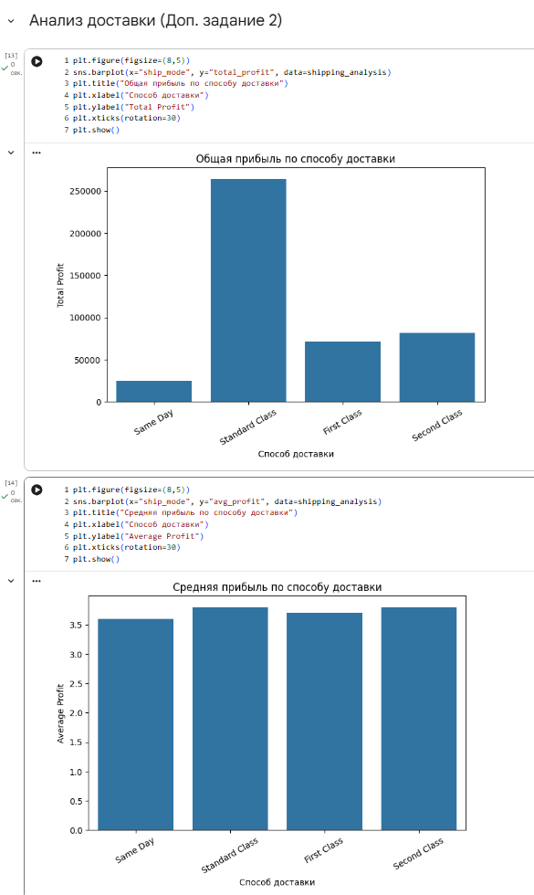

# Лабораторная работа 2.1
## Динамические соединения с базами данных (Pentaho PDI)

**Вариант №6**
| Основной фильтр для загрузки в БД | Доп. задание 1 (Аналитика) | Доп. задание 2 (Аналитика) |
|------|----------|----------|
| Скидка: Discount > 0 | Анализ по сегментам | Отчет по возвратам |


*Цель работы:* получить практические навыки создания ETL-процесса в Pentaho Data Integration, включающего:
- динамическую загрузку CSV по HTTP
- нормализацию данных в MySQL
- устранение дубликатов
- обработку ошибок
- выполнение аналитических задач


## Дополнения в трансформацию

- **Filter Rows**  
  

## Job



## Transformation
Трасформация 1 - orders


Трасформация 2 - customers


Трасформация 2 - products



  ## SQL-запросы проверки данных

```sql
-- Количество строк в таблицах
SELECT COUNT(*) FROM orders;
SELECT COUNT(*) FROM customers;
SELECT COUNT(*) FROM products;
```

```sql
-- Примеры данных
SELECT * FROM orders LIMIT 5;
SELECT * FROM customers LIMIT 5;
SELECT * FROM products LIMIT 5;
```

```sql
-- Проверка фильтра Profit > 0
SELECT COUNT(*) FROM orders WHERE profit <= 0;
```
![SQL3(img/img7.png)

## Дополнительный анализ в Colab (Python)

Для анализа данных после ETL использовался Google Colab.  
- **Подключение**  
  
  - **Задание 1**  
  
  - **Задание 2**  
  

### Выводы
В ходе лабораторной работы 2.1 была реализована полная цепочка ETL-процесса: выполнена динамическая загрузка CSV-файла по HTTP, нормализация данных и разделение на три таблицы (orders, customers, products), реализована дедупликация и обработка ошибок с использованием Pentaho Data Integration. Для индивидуального варианта 6 были применены фильтры по прибыли (Profit > 0), а также выполнены аналитические задания: построен отчет по категориям товаров и анализ способов доставки с визуализацией результатов в Colab с использованием Python. Работа позволила закрепить навыки настройки динамических соединений, обработки данных, агрегаций и построения аналитических отчетов на основе нормализованной базы данных.
