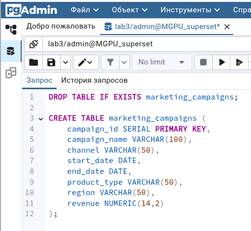
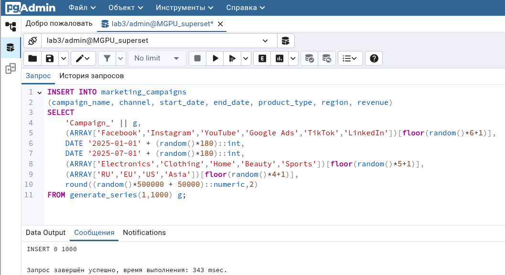
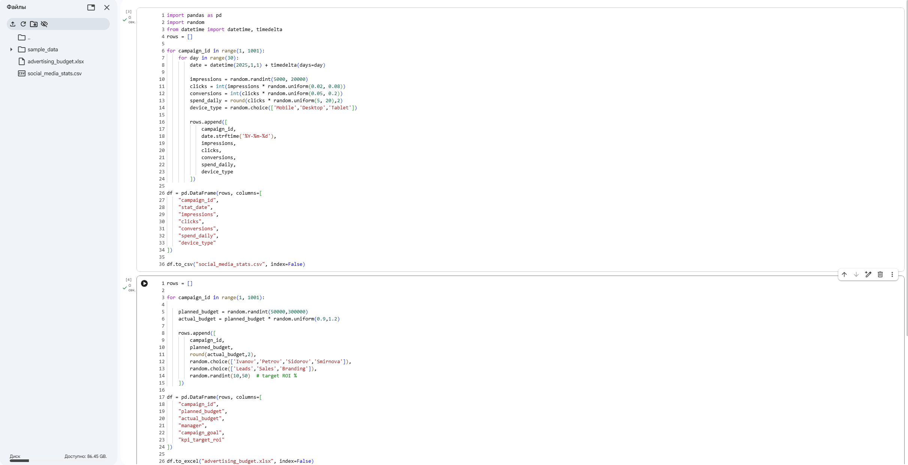
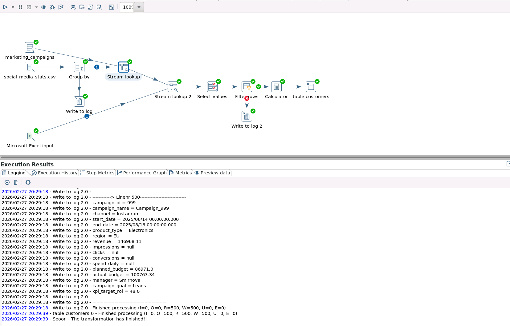
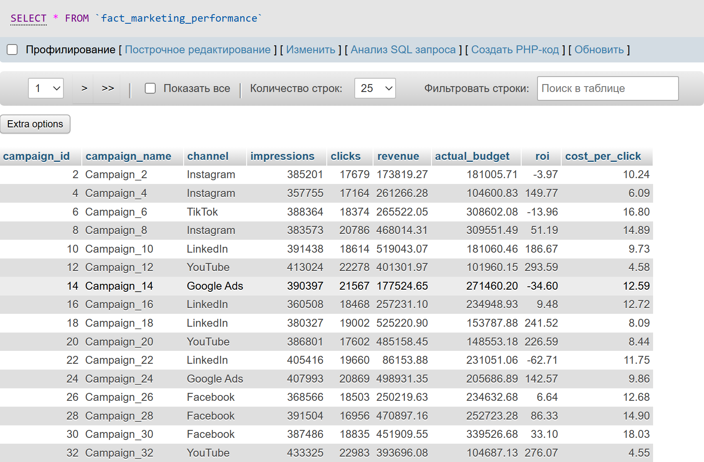
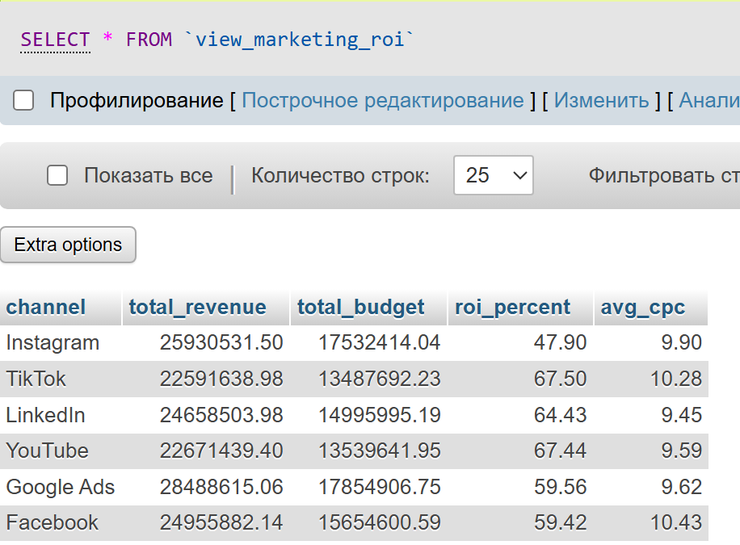
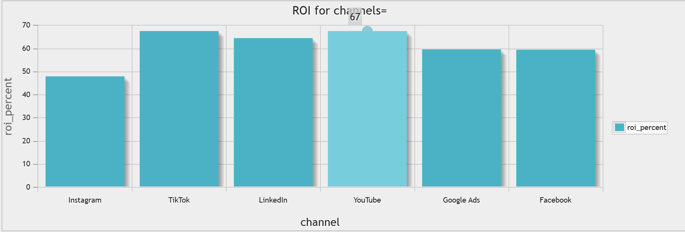

# Лабораторная работа №3  
## Интеграция данных из нескольких источников. Обработка и согласование данных

## Вариант 6 
Маркетинг

Необходимо интегрировать данные из трёх источников:

- PostgreSQL — данные о рекламных кампаниях  
- CSV — статистика из социальных сетей (показы, клики, конверсии)  
- Excel — бюджеты рекламных кампаний  

Требуется:

- Проанализировать ROI (возврат инвестиций) маркетинговых каналов  
- Рассчитать стоимость клика (CPC)

## Цель работы  

Разработать ETL-процесс для интеграции данных из разнородных источников (PostgreSQL, CSV, Excel) в целевое хранилище MySQL и выполнить аналитическую обработку данных для оценки эффективности маркетинговых каналов.

## Описание данных  
### 1. PostgreSQL (основной источник)

Таблица: `marketing_campaigns`

Содержит:

- `campaign_id` — идентификатор кампании  
- `campaign_name` — название кампании  
- `channel` — рекламный канал  
- `start_date`, `end_date` — период проведения  
- `product_type` — тип продукта  
- `region` — регион  
- `revenue` — полученная выручка  

Объём данных: 1000 записей.
### 2. CSV-файл (операционная статистика)

Файл: `social_media_stats.csv`

Содержит:

- `campaign_id`  
- `stat_date`  
- `impressions` — показы  
- `clicks` — клики  
- `conversions` — конверсии  
- `spend_daily` — дневные расходы  
- `device_type` — тип устройства  

Объём данных: ~30 000 записей.  
Перед объединением выполнена агрегация по `campaign_id`.
### 3. Excel-файл (финансовое планирование)

Файл: `advertising_budget.xlsx`

Содержит:

- `campaign_id` — идентификатор кампании (ключ для объединения данных)
- `planned_budget` — запланированный бюджет кампании
- `actual_budget` — фактически израсходованный бюджет
- `manager` — ответственный менеджер
- `campaign_goal` — цель кампании (лиды, продажи, узнаваемость)
- `kpi_target_roi` — целевое значение ROI (%)

Объём данных: 1000 записей.

---

## Архитектура решения  

Решение построено по трёхслойной архитектуре:

- Source Layer — PostgreSQL, CSV, Excel  
- Storage Layer — MySQL (таблица фактов)  
- Business Layer — аналитическое представление (VIEW)  

---

## Ход работы  
### 1. Подготовка источника PostgreSQL  

Создана таблица `marketing_campaigns` и сгенерированы тестовые данные (1000 строк).

### 2. Подготовка файловых источников  

Сгенерированы:

- CSV-файл со статистикой по дням  
- Excel-файл с бюджетами кампаний  

### 3. Разработка ETL-трансформации в Pentaho  

В среде Pentaho Data Integration (Spoon) реализована трансформация [`.ktr`](lab3.ktr), выполняющая:

1. Чтение данных из PostgreSQL (Table Input)  
2. Чтение CSV (CSV Input)  
3. Агрегацию статистики (Group By)  
4. Объединение источников (Stream Lookup)  
5. Чтение Excel (Excel Input)  
6. Очистку данных (Select Values, Filter Rows)  
7. Расчёт показателей (Calculator)  
8. Загрузку в MySQL (Table Output)  

### 4. Загрузка данных в MySQL  

Данные загружены в таблицу фактов:

`fact_marketing_performance`

### 5. Создание аналитического представления  

Создано представление `view_channel_performance` для анализа эффективности каналов.

### 6. Визуализация результатов  

На основе представления построен график ROI по каналам непосредственно в MySQL. Это лишь пример возможности построения графика на основе полученных данных.

---

## Выводы  

В ходе выполнения лабораторной работы реализована интеграция данных из трёх разнородных источников (PostgreSQL, CSV, Excel) в единое хранилище MySQL.  

В процессе ETL выполнены:

- Агрегация статистических данных  
- Очистка и приведение типов данных  
- Расчёт ключевых маркетинговых показателей  

Рассчитаны и проанализированы:

- ROI маркетинговых каналов  
- Стоимость клика (CPC)  

Полученное решение позволяет оценивать эффективность рекламных каналов, выявлять убыточные направления и принимать решения по перераспределению маркетингового бюджета.
