# Лабораторная работа 5.1  
## Проектирование объектной модели данных и построение ETL-конвейера
### Вариант 6
---

### Цель работы

Целью лабораторной работы является изучение принципов построения ETL-конвейеров и разработка аналитического решения для обработки данных с использованием Apache Airflow.

В ходе работы необходимо:

- развернуть среду оркестрации Apache Airflow в Docker;
- изучить структуру и принцип работы DAG;
- реализовать ETL-конвейер для получения и обработки данных;
- обучить модель машинного обучения;
- использовать модель для прогнозирования бизнес-метрик.

---

### Подготовка среды

Для выполнения работы была использована виртуальная машина Ubuntu.
Сначала был клонирован репозиторий с материалами лабораторной работы:

**Клонирование репозитория**

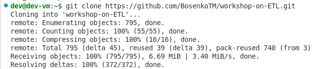

После клонирования был выполнен и собран Docker-образ Apache Airflow:

**Сборка образая**

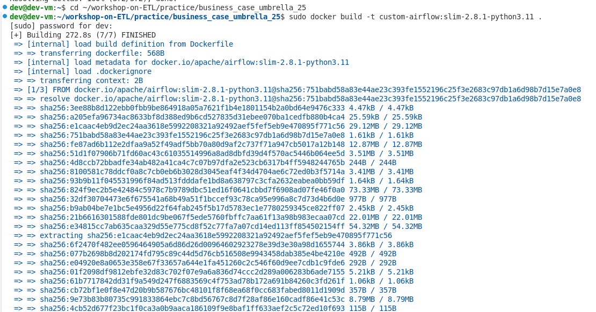

После запуска сервисов веб-интерфейс Airflow стал доступен по адресу http://localhost:8080

**Веб-интерфейс**

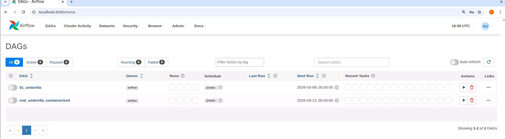

### Запуск модельного кейса
Кейс активирован

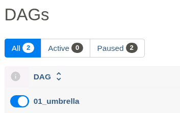

### Настройка реального конвейера
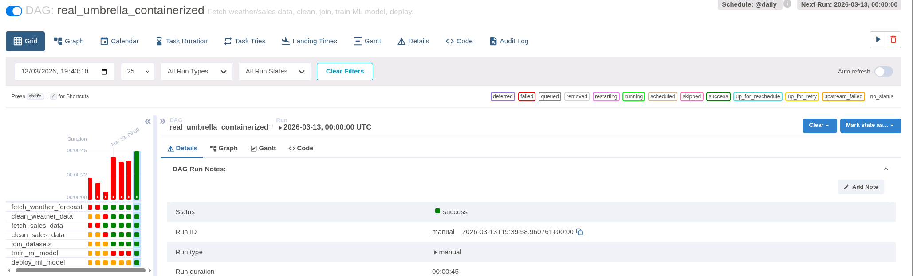

### Работа с прогнозированием
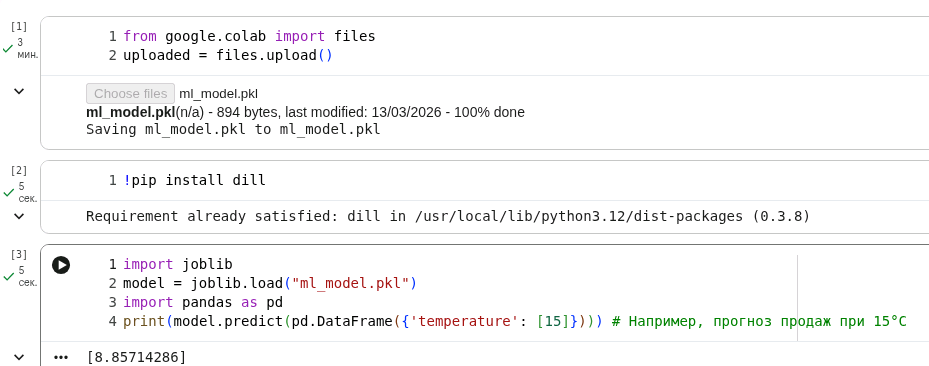

### Архитектура решения
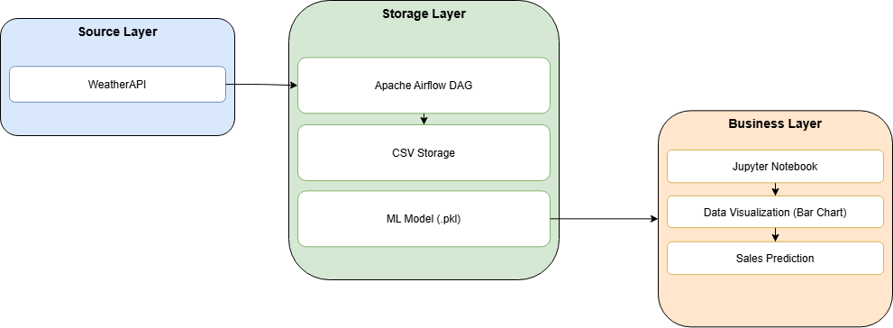

## Решение варианта 6
Требования варианта:
| Этап | Требование |
|-----|-----|
| Сбор данных | прогноз погоды для Рима на 5 дней |
| Трансформация | замена пропусков средним |
| Визуализация | построение Bar Chart |
### Дерево проекта
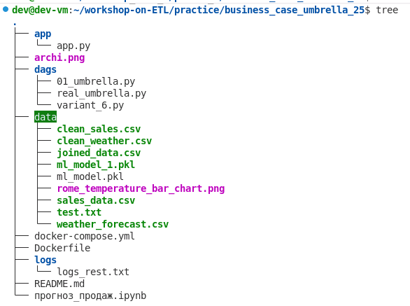

### Реализация DAG

Для выполнения индивидуального задания был создан DAG `variant_6.py`.  
Он реализует ETL-конвейер, который выполняет следующие этапы:
1. получение прогноза погоды из WeatherAPI для города Rome;
2. очистку данных;
3. получение и очистку данных продаж;
4. объединение датасетов;
5. обучение модели машинного обучения;
6. построение столбчатой диаграммы.
Фрагмент реализации DAG:

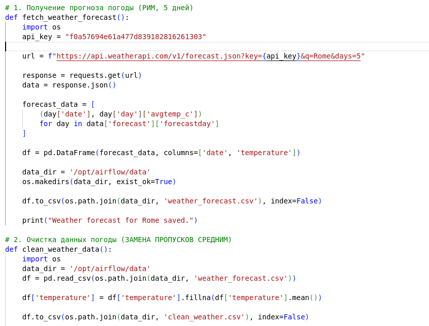

### Результат выполнения DAG

После запуска DAG variant_6 в интерфейсе Apache Airflow все задачи были успешно выполнены.

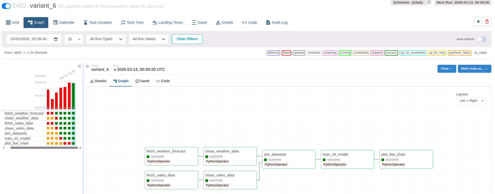 

Диаграмма Ганта 

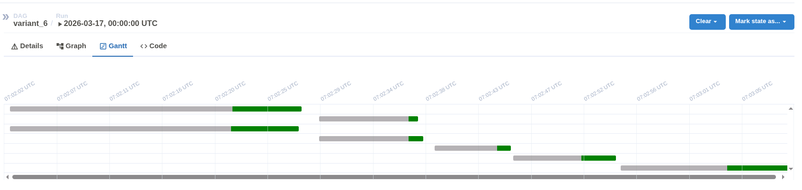 

### Построение графика
В рамках задания была реализована визуализация температурных данных.
В результате выполнения DAG был построен Bar Chart, отображающий прогноз температуры для города Rome на 5 дней.

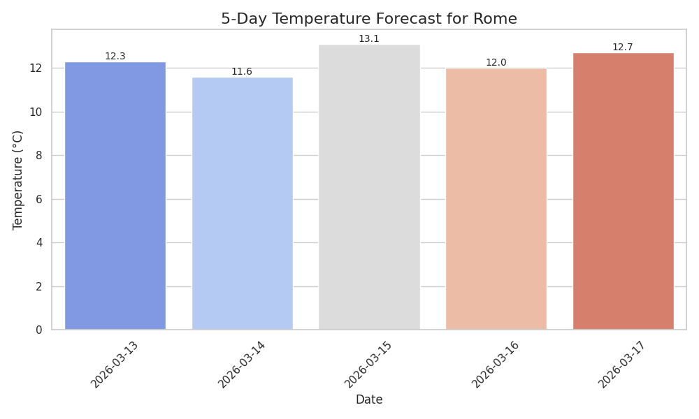 

График позволяет визуально оценить изменение температуры в течение прогнозируемого периода.

### Прогнозирование продаж
После выполнения ETL-конвейера был создан Jupyter Notebook **прогноз_продаж.ipynb**.
В ноутбуке выполняются следующие действия:
1. загрузка обученной модели
2. формирование входных данных
3. прогнозирование продаж
Для температуры **12.34°C** был получен прогноз:
При температуре 12.34°C прогнозируемые продажи составят: 8.86
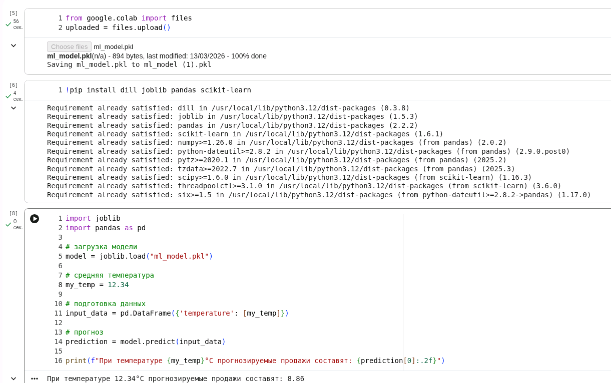

### Работа со Streamlit
Для визуализации результатов ETL-конвейера был реализован веб-интерфейс с использованием библиотеки **Streamlit**.

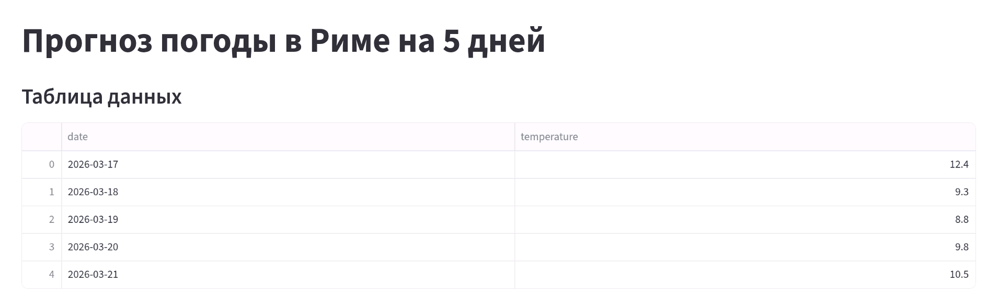
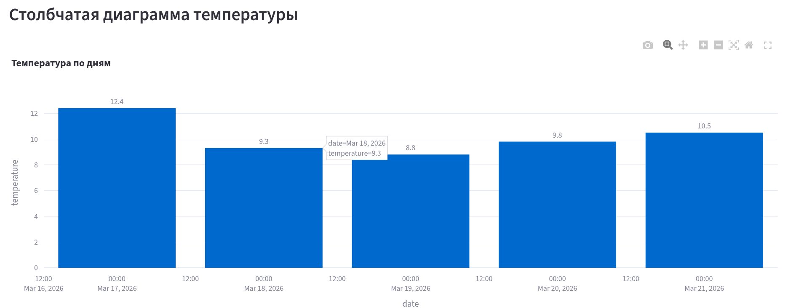
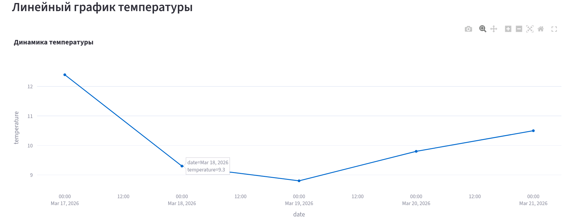

---

### Вывод

В ходе лабораторной работы был реализован полный ETL-конвейер обработки данных.

В результате выполнения работы:

- развернута среда Apache Airflow в Docker;
- реализован ETL-процесс получения и обработки данных;
- разработан DAG для автоматизации обработки данных;
- обучена модель машинного обучения;
- выполнено прогнозирование продаж;
- реализована визуализация данных.

Полученные результаты демонстрируют практическое применение инструментов Data Engineering для построения автоматизированных систем обработки и анализа данных.
