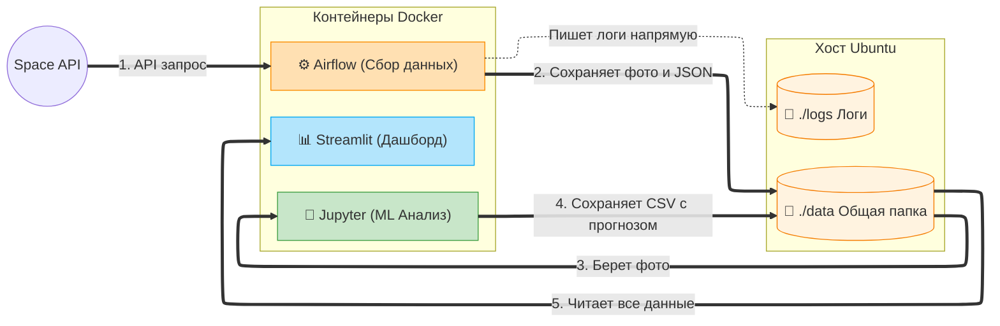

# Проект "Rocket Launch ETL & ML Analytics"

## Постановка задачи
Проект реализует автоматизированный конвейер (ETL) по загрузке данных о ближайших космических запусках и их фотографий из внешнего API (Launch Library 2). После загрузки данных применяется Machine Learning (Zero-Shot Classification) для определения типа ракеты на загруженных фотографиях. Для визуализации результатов развернут интерактивный дашборд. Архитектура оптимизирована для легкого доступа к логам и данным из хост-ОС Ubuntu без необходимости входа в контейнеры.

## Диаграмма архитектуры



### Пояснение к архитектуре

Архитектура построена по принципу **микросервисов с общим разделяемым хранилищем (Shared Volumes)**. Это позволяет сервисам быть независимыми, но при этом легко обмениваться файлами без сложной сетевой пересылки.

#### Внешние источники и Пользователь
* **Launch Library 2 API.** Внешний REST API, откуда Airflow берет расписание запусков и прямые ссылки на фотографии ракет.
* **Пользователь.** Взаимодействует с системой исключительно через веб-браузер по открытым портам (`8080`, `8888`, `8501`), не выполняя команды внутри контейнеров.

#### Хост-система и Локальные папки (Bind Mounts)
На виртуальной машине Ubuntu лежат обычные папки (`./dags`, `./data`, `./logs`). Благодаря технологии *Bind Mounts* в Docker, эти папки проброшены внутрь каждого контейнера.
* **`./logs/`**. Airflow пишет сюда логи выполнения задач. Вы можете читать их напрямую из Ubuntu (`cat ./logs/...`), что решает задачу **"оптимизации логов, чтобы не лезть внутрь контейнера"**.
* **`./data/`**. Выступает в роли "Озера данных" (Data Lake). Сюда складываются сырые данные (JSON, картинки) и результаты ML.
* **`./dags/`**. Содержит код пайплайна (`download_rocket_launches.py`), который Airflow автоматически подхватывает.

#### Apache Airflow (ETL контур)
Отвечает за сбор и первичную обработку данных.
* **Scheduler.** Запускает процесс по расписанию (или вручную). Делает HTTP-запросы к внешнему API, парсит JSON и скачивает картинки напрямую в примонтированную папку `./data/images/`.
* **Webserver.** UI для управления пайплайном (запуск, мониторинг, просмотр логов).
* **PostgreSQL.** Служебная база данных для самого Airflow (хранит статусы задач, историю запусков).

#### Jupyter (ML контур)
Отвечает за интеллектуальную обработку.
* Запускается в соседнем контейнере из того же образа, где уже установлены тяжелые библиотеки (`torch`, `transformers`). 
* Читает скачанные фотографии из `./data/images/`, прогоняет их через предобученную нейросеть `CLIP` (Zero-Shot Classification) и записывает предсказания обратно в `./data/ml_predictions.csv`.

#### Streamlit (Аналитический контур)
Отвечает за визуализацию (BI).
* Постоянно "слушает" папку `./data/`. Как только Airflow скачивает новые `launches.json`, а Jupyter генерирует `ml_predictions.csv`, Streamlit автоматически подхватывает эти файлы.
* Строит интерактивные графики и отображает галерею фотографий с прикрепленными тегами предсказанных типов ракет.


## Технический стек и Архитектура
* **ОС:** Ubuntu 22.04 LTS
* **Оркестрация:** Docker, Docker Compose v2
* **ETL:** Apache Airflow 2.8.1 (Python 3.11)
* **ML:** PyTorch, Hugging Face `transformers` (CLIP Model), Pandas
* **Аналитика:** Streamlit

**Архитектура директорий:**
```text
.
├── app/                  # Скрипты Streamlit (app.py)
├── dags/                 # Airflow DAGs (download_rocket_launches.py)
├── data/                 # Локальная папка для JSON, фото и ML-результатов
├── logs/                 # Логи Airflow (доступны напрямую из хоста)
├── ml.ipynb              # ML Ноутбук для распознавания ракет
├── docker-compose.yml    
└── Dockerfile            
```

## Шаги по запуску окружения (Ubuntu 22.04)

### 1. Подготовка инфраструктуры
Откройте терминал на виртуальной машине Ubuntu 22.04 и выполните настройку директорий:

```bash
# Создание необходимых папок
mkdir -p dags data logs app

# Установка правильных прав доступа для Airflow (UID 50000)
# Это ВАЖНО, чтобы Airflow мог писать файлы в папки data и logs
sudo chown -R 50000:0 data logs
sudo chmod -R 775 data logs
```

### 2. Сборка и запуск Docker Compose
```bash
# Сборка кастомного образа с ML и Streamlit
sudo docker build -t custom-airflow:slim-2.8.1-python3.11 .

# stop containers
sudo docker stop $(sudo docker ps -q)
sudo docker network prune -f
sudo chmod 644 ml.ipynb
sudo chmod 755 .


# Запуск инфраструктуры в фоновом режиме
sudo docker compose up -d
```

### 3. Выполнение ETL (Airflow)
1. Откройте браузер по адресу: `http://localhost:8080`
2. Логин и пароль: `admin` / `admin`
3. Найдите DAG `download_rocket_launch`, включите его (Unpause) и запустите (Trigger DAG).
4. Убедитесь, что в папке `./data/images/` появились фотографии, а файл `./data/launches.json` скачан.

**Как посмотреть логи без входа в контейнер:**
Логи теперь проброшены прямо в папку `logs` на вашем сервере.
```bash
cat ./logs/dag_id=download_rocket_launch/run_id=.../.../task.log
```

### 4. Выполнение ML-анализа (Jupyter in Docker)

Мы не устанавливаем библиотеки на хост-систему: всё необходимое для ML-анализа (PyTorch, Hugging Face, Jupyter) уже развернуто в изолированном контейнере Docker и работает из коробки.

1. Откройте браузер на вашем компьютере и перейдите по адресу: 
   👉 `http://localhost:8888`
2. В открывшемся интерфейсе Jupyter вы увидите файлы вашего проекта. Кликните на файл `ml.ipynb`.
3. В верхнем меню нажмите **"Cell" -> "Run All"** (или **"Run" -> "Run All Cells"**), чтобы запустить процесс классификации скачанных фотографий ракет.
4. Модель `CLIP` проанализирует картинки из папки `data/images` и предскажет тип каждого космического корабля.
5. По завершении работы скрипта результаты автоматически сохранятся в примонтированную папку: `./data/ml_predictions.csv`. 

*Примечание. Поскольку папка `data` примонтирована к хосту (Volume Bind Mount), вы можете увидеть сформированный файл `ml_predictions.csv` прямо в консоли Ubuntu, не заходя в контейнер (`cat ./data/ml_predictions.csv`).*

### 5. Просмотр аналитики (Streamlit)
Streamlit запускается автоматически в Docker-контейнере.
Откройте браузер по адресу: `http://localhost:8501`
Здесь вы увидите статистику запусков и галерею классифицированных ML-моделью изображений.

### Очистка окружения
```bash
sudo docker compose down -v --remove-orphans
# Удалить скачанные данные (осторожно)
# sudo rm -rf data/* logs/*
```
