# Лабораторная работа 5.2

**Разработка алгоритмов для трансформации данных. Airflow DAG**

---

## Постановка задачи

Целью работы является разработка ETL-конвейера для автоматической загрузки, обработки и анализа данных о космических запусках с использованием Apache Airflow в контейнеризированной среде.

В рамках варианта №6 необходимо реализовать:

* автоматическую обработку данных запусков (ETL),
* уведомления при сбоях,
* анализ частоты запусков за месяц.

---

##  Архитектура решения


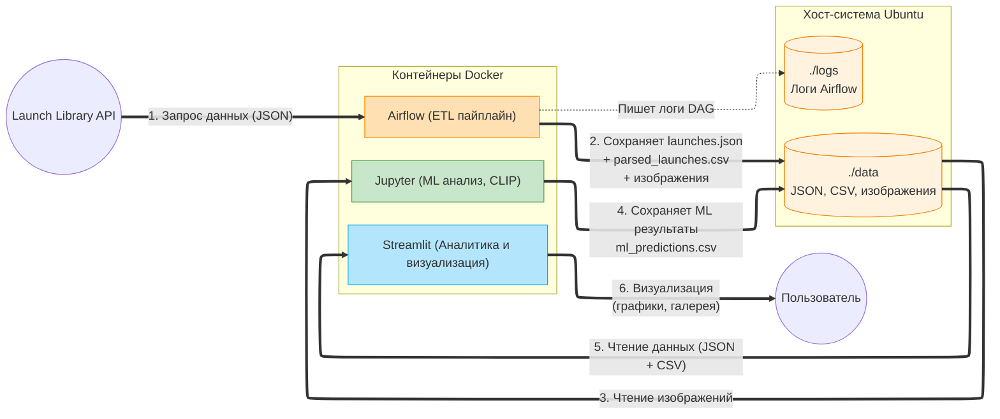

---

##  Ход выполнения работы

### Дерево проекта 

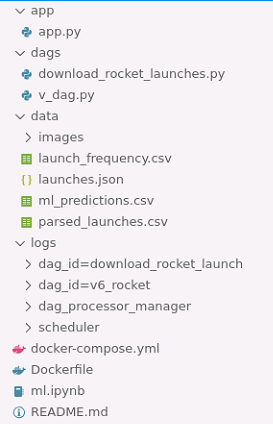

### 1. Подготовка окружения

Была развернута виртуальная машина Ubuntu 22.04.

Выполнено клонирование репозитория:

```bash
git clone https://github.com/BosenkoTM/workshop-on-ETL.git
cd workshop-on-ETL/practice/business_case_rocket_26
```

Созданы рабочие директории:

```bash
mkdir -p dags data logs app
sudo chown -R 50000:0 data logs
sudo chmod -R 775 data logs
```

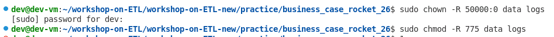

---

### 2. Сборка и запуск Docker-инфраструктуры

Собран кастомный Docker-образ:

```bash
docker build -t custom-airflow:slim-2.8.1-python3.11 .
```
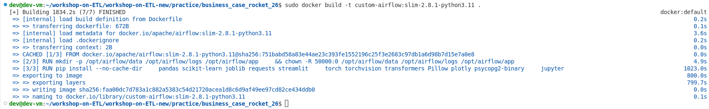

Загружалось полчаса 

Подготовка:
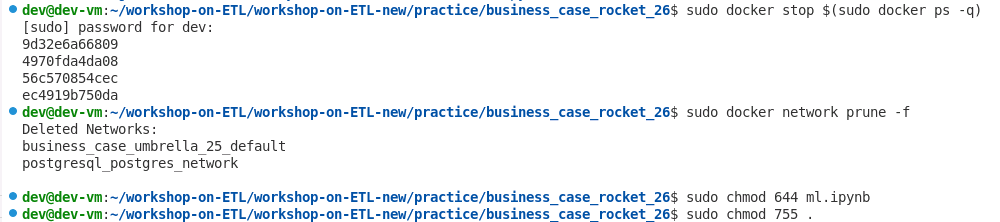

Запущены контейнеры:

```bash
docker compose up -d
```
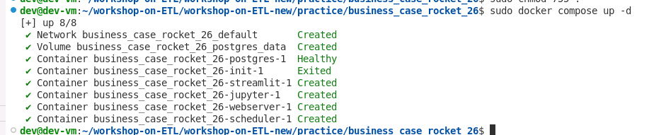

Проверена доступность сервисов:

* Airflow → http://localhost:8080
* Jupyter → http://localhost:8888
* Streamlit → http://localhost:8501

---

### 3. Проверка базового ETL-пайплайна

В Airflow был запущен базовый DAG:

```text
download_rocket_launch
```
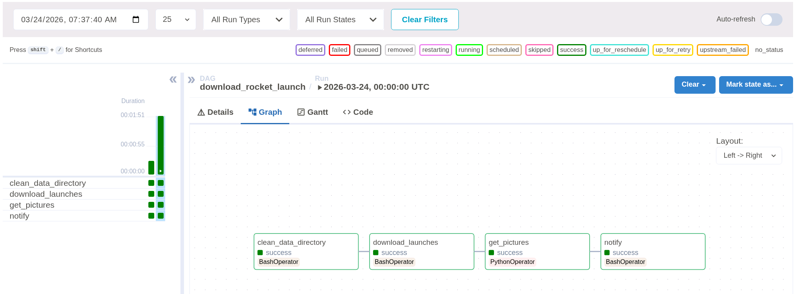

Диаграмма Ганта:

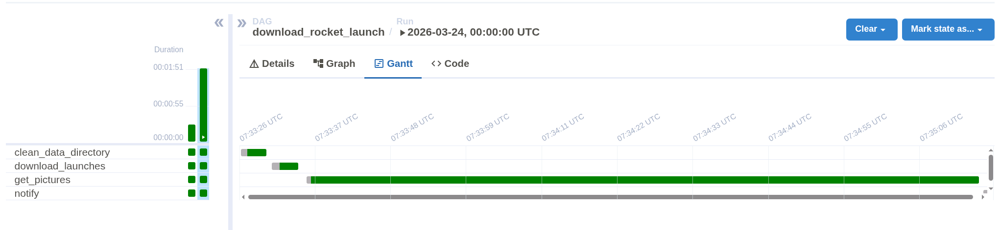

В результате выполнения:

* загружен файл `launches.json`
* скачаны изображения в `data/images`

---

### 4. Выполнение ML-анализа (Jupyter in Docker)

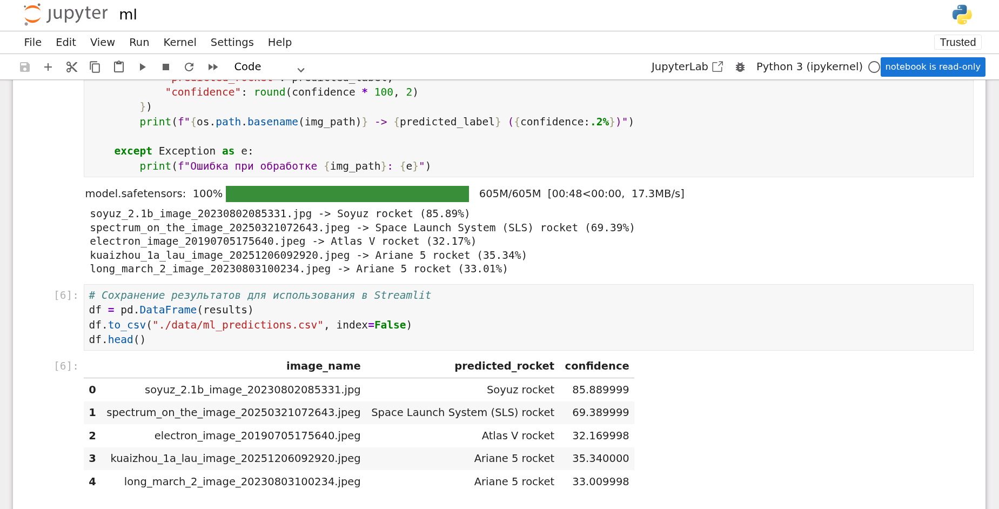

### 5. Визуализация в Streamlit

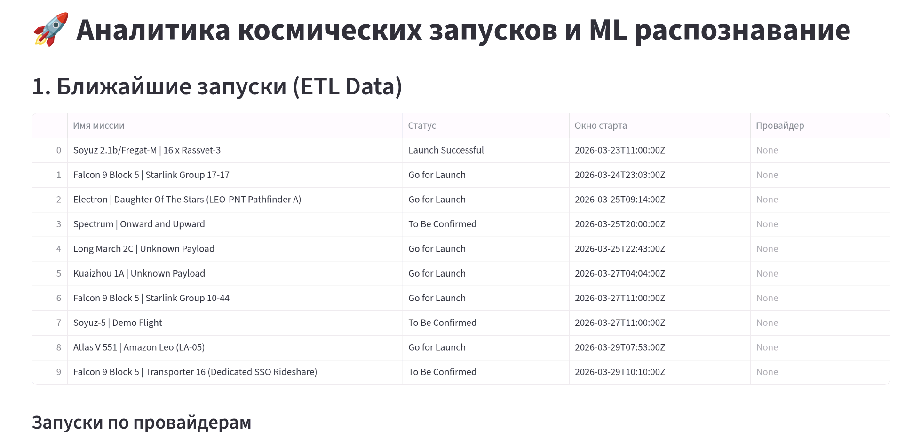

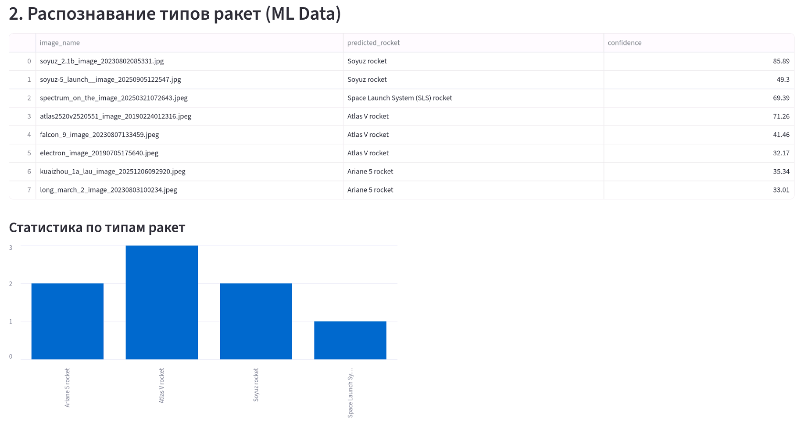

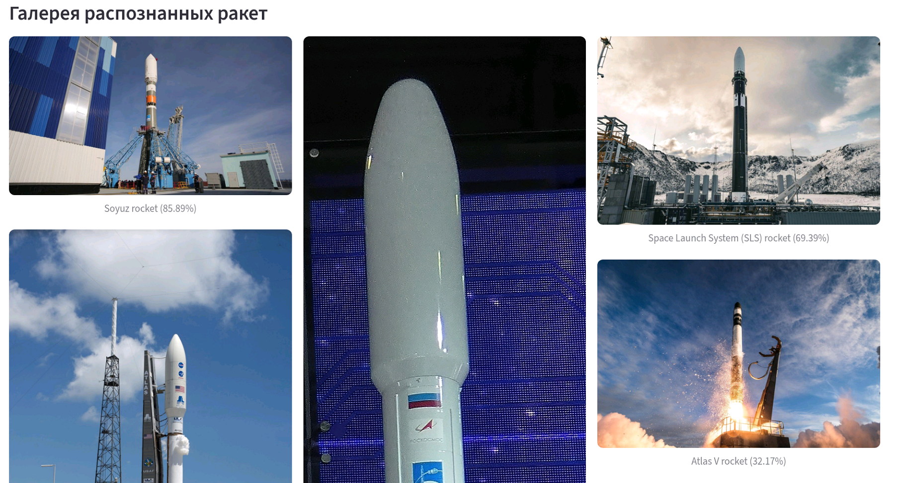

### 6. Реализация собственного DAG (вариант 6)

Был разработан DAG с загрузкой 100 фотографий:

```text
listing_sabina_rocket
```

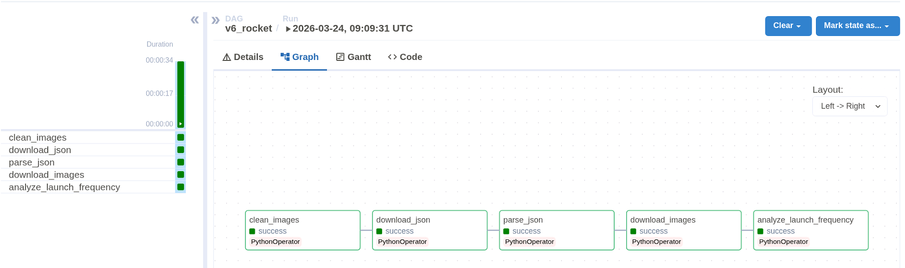

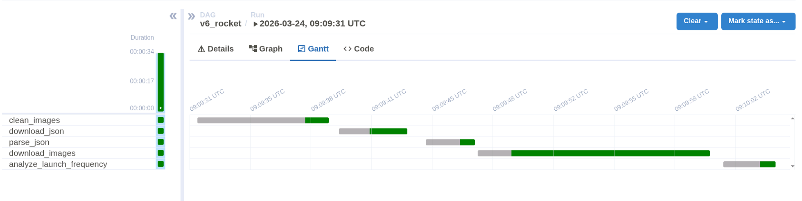
---

#### 🔹 Задание 1 — Автоматическая обработка данных (ETL)

Реализован полный ETL-процесс:

* **Extract** — загрузка данных из API
* **Transform** — преобразование JSON → CSV
* **Load** — загрузка изображений

Используемые файлы:

* `launches.json`
* `parsed_launches.csv`
* `images/`

---

#### 🔹 Задание 2 — Уведомления при сбоях

Реализована функция:

```python
def notify_failure(context):
    print(f"Ошибка в задаче: {context['task_instance'].task_id}")
```

Функция подключена ко всем задачам DAG через:

```python
on_failure_callback=notify_failure
```

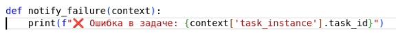
---

#### 🔹 Задание 3 — Анализ частоты запусков

Реализован анализ количества запусков по месяцам:

* преобразование даты (`net`)
* группировка по месяцам
* подсчёт запусков

Результат сохраняется в:

```text
data/launch_frequency.csv
```

---

### 6. Выполнение ML-анализа

В Jupyter Notebook (`ml.ipynb`) выполнена классификация изображений с использованием модели CLIP.

Результаты сохранены в:

```text
data/ml_predictions.csv
```

---

### 7. Визуализация результатов

В Streamlit реализована визуализация:

* статистика запусков
* галерея изображений
* результаты ML
* график частоты запусков


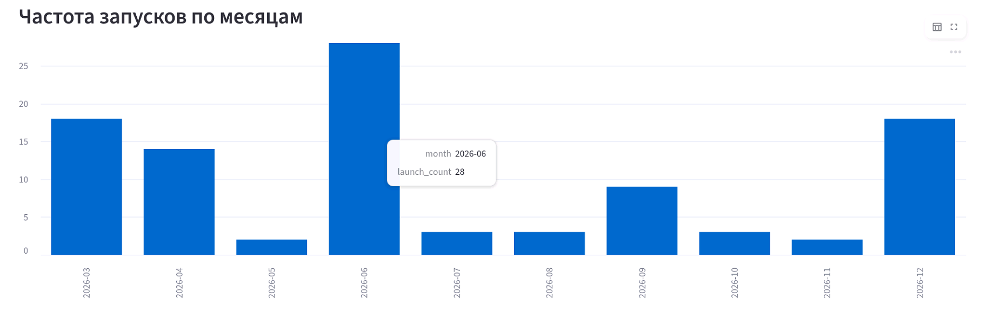
---


##  Выводы

В ходе работы был реализован полноценный ETL-конвейер с использованием Apache Airflow.

Были получены навыки:

* работы с Docker и Airflow
* обработки JSON-данных
* построения ETL-пайплайнов
* анализа и агрегации данных
* визуализации результатов

Система обеспечивает автоматическую загрузку, обработку и анализ данных о космических запусках.
---
