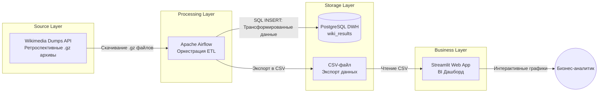
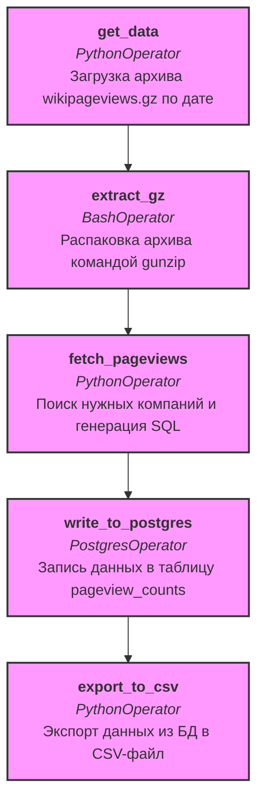
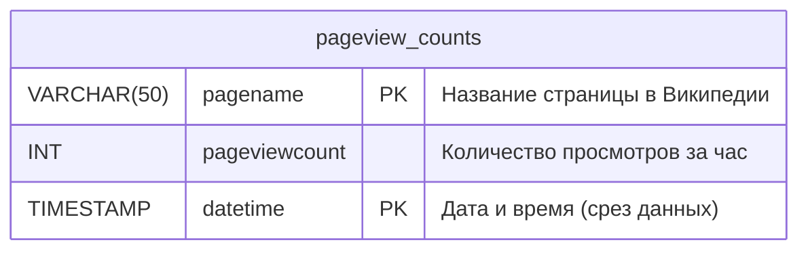

# Бизнес-кейс «StockSense». Аналитика популярности брендов на основе Википедии

## Описание проекта

Бизнес-кейс **«StockSense»** представляет собой комплексную аналитическую платформу для отслеживания интереса общественности к публичным компаниям, криптовалютам, известным личностям или брендам на основе количества просмотров их страниц в Википедии. 

**Бизнес-гипотеза.** Резкий всплеск интереса к странице сущности в Википедии (Pageviews) тесно коррелирует с важными новостными инфоповодами, выходом новых продуктов или финансовыми отчетами. Эти данные могут использоваться аналитиками как предиктивный сигнал для инвестиционного или маркетингового анализа.

**Глобальная задача проекта** — с нуля построить полноценный конвейер данных (Data Pipeline). Вам предстоит реализовать:
1. **ETL-процесс** (Extract, Transform, Load) — автоматический сбор, очистку и загрузку данных.
2. **DWH** (Data Warehouse) — хранилище данных для складирования обработанной информации.
3. **BI-слой** (Business Intelligence) — интерактивный дашборд для визуализации бизнес-метрик.

---

## Технологический стек

* **Apache Airflow (Python 3.11).** Мощный оркестратор задач. Используется для планирования (scheduling) и выполнения направленных ациклических графов (DAG) нашего ETL-процесса.
* **PostgreSQL.** Реляционная СУБД. В проекте развернуто два экземпляра:
  1. `postgres` — служебная БД для хранения метаданных самого Airflow.
  2. `wiki_results` — целевое хранилище бизнес-данных (Data Warehouse).
* **Streamlit.** Современный Python-фреймворк для быстрого создания интерактивных веб-приложений и BI-дашбордов. Позволяет визуализировать данные без знаний HTML/CSS/JS.
* **Docker & Docker Compose.** Инструменты контейнеризации. Обеспечивают изоляцию среды, гарантируя, что проект запустится одинаково на любом ПК без конфликтов зависимостей.

---

## Общая архитектура (System Architecture)



## Архитектура DAG в Airflow (ETL Pipeline)



## ERD-схема базы данных (Entity-Relationship Diagram)



*Примечание. Первичный ключ составной и включает в себя название страницы и временную метку, чтобы избежать дубликатов при повторных запусках (идемпотентность).*

---

## Пошаговое руководство (Развертывание и Запуск)

Все действия выполняются в ОС Ubuntu с установленным Visual Studio Code, Docker и плагином Docker Compose.

### Шаг 1. Клонирование и подготовка среды
Откройте терминал Ubuntu и склонируйте репозиторий (или создайте структуру папок, если работаете с нуля):

```bash
git clone https://github.com/BosenkoTM/workshop-on-ETL.git
cd workshop-on-ETL
```
Убедитесь, что порты `8080` (Airflow), `8501` (Streamlit), `5432` и `5433` (PostgreSQL) свободны на вашей машине.

### Создаем необходимые папки, если они еще не созданы (если не клонировали репо с ресурса GitHub)

```bash
mkdir -p dags logs data scripts streamlit
```

### Устанавливаем владельца UID 50000 (стандартный ID пользователя airflow в Docker)

 Это позволит Airflow записывать логи и скачивать файлы в папку data

```bash
sudo chown -R 50000:0 dags logs data scripts streamlit
```

### Устанавливаем права на чтение, запись и выполнение для владельца и группы

```bash
sudo chmod -R 775 dags logs data scripts streamlit
```

### Шаг 2. Сборка кастомного образа Docker
Нам необходимо собрать образ Airflow, в который будут добавлены дополнительные библиотеки (в т.ч. Streamlit и коннекторы к БД).
```bash
sudo docker build --no-cache -t custom-airflow:slim-2.8.1-python3.11 .
```

### Шаг 3. Инициализация и запуск кластера
Запустите кластер в фоновом режиме:
```bash
sudo docker compose up -d
```
*Первый запуск займет около 1-2 минут, так как контейнер `init` должен применить миграции базы данных и создать пользователя-администратора.*

### Проверка сервисов:

- Airflow UI: http://localhost:8080 (Логин/Пароль: admin / admin). Включите и запустите DAG stocksense_wiki_etl.
- Streamlit BI: http://localhost:8501. Обновите страницу после того, как DAG успешно отработает, чтобы увидеть графики.
- DWH (Postgres). Доступен на localhost:5433 (Пользователь: airflow, БД: airflow).


### Шаг 4. Работа в Apache Airflow (ETL)
1. Откройте браузер и перейдите по адресу: **http://localhost:8080**
2. Авторизуйтесь с учетными данными:
   * **Логин:** `admin`
   * **Пароль:** `admin`
3. В списке DAG найдите `stocksense_wiki_etl`.
4. Снимите его с паузы (переключатель слева) и нажмите кнопку **Trigger DAG** (кнопка Play справа) для ручного запуска.
5. Перейдите в представление **Graph** или **Gantt**, чтобы проследить за выполнением задач. Дождитесь, пока все 4 задачи загорятся темно-зеленым цветом (Success).

### Шаг 5. Работа со Streamlit (BI Аналитика)
1. Как только данные загрузились, откройте новую вкладку в браузере: **http://localhost:8501**
2. Вы увидите интерактивный дашборд. На нем отобразятся сырые данные из DWH и графики динамики просмотров для сущностей по умолчанию.

### Шаг 6. Завершение работы
После завершения лабораторной работы корректно остановите все контейнеры, чтобы освободить ресурсы ПК:

```bash
sudo docker compose down -v
```

---

## Индивидуальные варианты заданий

Каждый студент выполняет **строго свой вариант**. Для выполнения задания вам потребуется:

1. Отредактировать файл `dags/wiki_pageviews.py`. заменить значения в переменной `TARGET_PAGES` на компании из вашего варианта.
2. Провести аналитику: написать SQL-запрос согласно **Подзадаче 2** и добавить его выполнение/результат в ваш отчет.
3. Отредактировать файл `streamlit/app.py`: добавить новый график согласно **Подзадаче 3**.

### Таблица вариантов (1-30)

| Вариант | Подзадача 1. Сущности (TARGET_PAGES) | Подзадача 2: Аналитический SQL-запрос (для отчета) | Подзадача 3. График в Streamlit |
|---|---|---|---|
| **1** | IT Гиганты: `Apple`, `Microsoft`, `Alphabet`, `Amazon` | Найти час с максимальным количеством просмотров для Apple. | Столбчатая диаграмма (Bar Chart) |
| **2** | Социальные сети: `Facebook`, `Twitter`, `TikTok` | Расчет среднего количества просмотров за доступный период по каждой сети. | Круговая диаграмма (Pie Chart) |
| **3** | Автопром: `Tesla`, `Toyota`, `Ford`, `BMW` | Вывести компанию с наименьшей волатильностью просмотров (MIN-MAX). | Линейный график (Line Chart) |
| **4** | Криптовалюты: `Bitcoin`, `Ethereum`, `Ripple` | Найти разницу просмотров между Bitcoin и Ethereum в каждый час. | График с областями (Area Chart) |
| **5** | Стриминги: `Netflix`, `Spotify`, `Disney+` | Топ-1 час по суммарному просмотру всех стримингов. | Столбчатая диаграмма (Bar Chart) |
| **6** | Игровые компании: `Nintendo`, `Sony`, `Electronic_Arts` | Расчет процентной доли просмотров Sony от общей суммы. | Круговая диаграмма (Pie Chart) |
| **7** | Банки: `JPMorgan_Chase`, `Goldman_Sachs`, `Citigroup` | Найти среднее количество просмотров для банков по часам. | Линейный график (Line Chart) |
| **8** | Ритейл: `Walmart`, `Target_Corporation`, `Costco` | Сравнение просмотров Walmart и Costco. | Горизонтальный Bar Chart |
| **9** | Космос: `SpaceX`, `Blue_Origin`, `Virgin_Galactic` | Найти часы, когда просмотры SpaceX превысили 100 (или среднее). | Точечный график (Scatter Plot) |
| **10** | Авиа: `Boeing`, `Airbus`, `Lockheed_Martin` | Найти суммарное количество просмотров авиакомпаний по времени. | Линейный график (Line Chart) |
| **11** | Фастфуд: `McDonald's`, `Burger_King`, `KFC` | Какая компания лидирует по просмотрам в конкретный (последний) час? | Круговая диаграмма (Pie Chart) |
| **12** | Фармацевтика: `Pfizer`, `Moderna`, `AstraZeneca` | Найти дисперсию (или размах) просмотров Pfizer. | График с областями (Area Chart) |
| **13** | E-commerce: `Alibaba`, `Amazon`, `eBay` | Вычислить скользящее среднее просмотров Amazon. | Линейный график (Line Chart) |
| **14** | Процессоры: `Intel`, `AMD`, `Nvidia` | Вывести часы, когда AMD обгонял Intel по просмотрам. | Столбчатая диаграмма (Bar Chart) |
| **15** | Облачные вычисления: `Amazon_Web_Services`, `Microsoft_Azure` | Найти суммарный трафик облачных сервисов. | Круговая диаграмма (Pie Chart) |
| **16** | Мобильные операторы: `Vodafone`, `Verizon`, `AT&T` | Отранжировать компании по просмотрам (использовать оконную функцию `RANK()`). | Горизонтальный Bar Chart |
| **17** | Платежные системы: `Visa`, `Mastercard`, `PayPal` | Найти час с наименьшим общим числом просмотров. | Линейный график (Line Chart) |
| **18** | Спортбренды: `Nike`, `Adidas`, `Puma` | Рассчитать долю просмотров Nike в каждый час. | График с областями (Area Chart) |
| **19** | Мессенджеры: `WhatsApp`, `Telegram`, `WeChat` | Вывести средние просмотры Telegram. | Столбчатая диаграмма (Bar Chart) |
| **20** | Энергетика: `ExxonMobil`, `Chevron`, `Shell_plc` | Найти часы пиковой активности для энергетики. | Точечный график (Scatter Plot) |
| **21** | Медиа: `The_New_York_Times`, `CNN`, `BBC` | Определить лидера медиа-отрасли по медианному значению. | Линейный график (Line Chart) |
| **22** | Азия-IT: `Samsung`, `Tencent`, `Baidu` | Найти час с максимальными просмотрами у Samsung. | Круговая диаграмма (Pie Chart) |
| **23** | Доставка: `Uber`, `Lyft`, `DoorDash` | Сравнить просмотры Uber и Lyft (математическая разница). | Столбчатая диаграмма (Bar Chart) |
| **24** | Люкс-бренды: `LVMH`, `Gucci`, `Prada` | Показать динамику роста/падения просмотров LVMH. | График с областями (Area Chart) |
| **25** | Косметика: `L'Oréal`, `Estée_Lauder`, `Sephora` | Вывести суммарную популярность брендов. | Горизонтальный Bar Chart |
| **26** | Индексные фонды: `S&P_500`, `Dow_Jones`, `Nasdaq` | Найти час максимальной синхронной активности фондов. | Линейный график (Line Chart) |
| **27** | Отели: `Marriott`, `Hilton`, `Airbnb` | Рассчитать долю Airbnb среди гостиничного бизнеса. | Круговая диаграмма (Pie Chart) |
| **28** | Авиакомпании: `Delta_Air_Lines`, `Ryanair`, `Emirates` | Кто имел самый высокий пик (максимум за один час)? | Столбчатая диаграмма (Bar Chart) |
| **29** | Развлечения: `Warner_Bros.`, `Universal_Studios` | Сравнение двух гигантов развлечений по времени. | График с областями (Area Chart) |
| **30** | Металлургия: `ArcelorMittal`, `Nucor`, `POSCO` | Найти самое низкое значение просмотров в отрасли. | Точечный график (Scatter Plot) |

> ⚠️ **Важно.** Названия страниц в Википедии чувствительны к регистру и символам. Строго используйте подчеркивание `_` вместо пробела (как в URL самой Википедии).

---

## Требования к отчету

По завершении работы необходимо сформировать PDF-файл в формате `ФИО-Вариант.pdf` и загрузить его в систему Moodle. 

**Отчет должен содержать:**
1. **Титульный лист и постановка задачи** (с указанием вашего варианта).
2. **Архитектура решения.** Вставьте диаграммы архитектуры (общая, DAG, ERD). Можно скопировать их из Mermaid-рендера на GitHub.
3. **Исходный код.** Листинги измененного файла DAG (`dags/wiki_pageviews.py`) и дашборда (`streamlit/app.py`).
4. **Аналитика БД.** SQL-запрос, написанный для Подзадачи 2, и скриншот результата его выполнения в СУБД (например, через DBeaver, pgAdmin или консоль psql).
5. **Мониторинг Airflow.** Скриншот успешного выполнения графа задач в интерфейсе Airflow, а также скриншот **диаграммы Ганта** (вкладка Gantt) для вашего DAG'а.
6. **BI Отчетность.** Скриншот вашего дашборда Streamlit с построенным графиком по Подзадаче 3.

---

## Критерии оценки (Максимум 10 баллов)

Оценка формируется из суммы баллов по следующим метрикам:

| Критерий | Баллы | Описание |
|---|:---:|---|
| **Развертывание среды** | **1** | Успешный запуск контейнеров Docker, доступность Airflow UI (порт 8080) и PostgreSQL (порты 5432/5433). |
| **Реализация ETL (DAG)** | **3** | DAG написан корректно, выполняет загрузку данных в БД согласно **Варианту (Подзадача 1)**. Ошибки выполнения (Failed states) отсутствуют. |
| **Работа с БД (SQL)** | **2** | Данные корректно записаны в целевую БД PostgreSQL. Написан рабочий и логически верный SQL-запрос для аналитической **Подзадачи 2** вашего варианта. |
| **Архитектура и документация**| **2** | В отчете представлены корректные схемы (общая архитектура + архитектура DAG + ERD). |
| **Визуализация и отчет** | **2** | Представлена диаграмма Ганта из Airflow. Построен корректный график в Streamlit на основе данных согласно **Подзадаче 3**. Отчет оформлен аккуратно и по ГОСТ/требованиям. |

#### Остановить и удали все контейнеры + volumes
sudo docker compose down -v

#### Удалить старый образ
sudo docker rmi custom-airflow:slim-2.8.1-python3.11

#### (Опционально) почистить всё неиспользуемое
sudo docker system prune -f

#### Собрать образ заново (--no-cache гарантирует чистую сборку)
sudo docker build --no-cache -t custom-airflow:slim-2.8.1-python3.11 .
