# Лабораторная работа 6.1  
## Разработка полного ETL-процесса. Бизнес-кейс «StockSense». Аналитика популярности брендов на основе Википедии 
---
ФИО: Джамалова Сабина Шахиновна

Вариант: **6**  
Тема: Игровые компании (Nintendo, Sony, Electronic Arts)

| Вариант | Подзадача 1. Сущности | Подзадача 2: Аналитический SQL-запрос | Подзадача 3. График в Streamlit |
|---|---|---|---|
| **6** | Игровые компании: `Nintendo`, `Sony`, `Electronic_Arts` | Расчет процентной доли просмотров Sony от общей суммы. | Круговая диаграмма (Pie Chart) |

---

## Постановка задачи

Целью работы является разработка полного ETL-процесса для анализа популярности игровых компаний **Nintendo, Sony и Electronic Arts** на основе данных о просмотрах их страниц в Википедии.

В рамках работы необходимо:

- реализовать автоматизированный сбор данных о просмотрах страниц Wikipedia (Pageviews);
- выполнить обработку и загрузку данных в реляционную базу данных PostgreSQL;
- провести аналитический расчёт доли просмотров компании **Sony** относительно общего числа просмотров;
- визуализировать результаты анализа с использованием BI-инструмента Streamlit.

---

## Архитектура решения
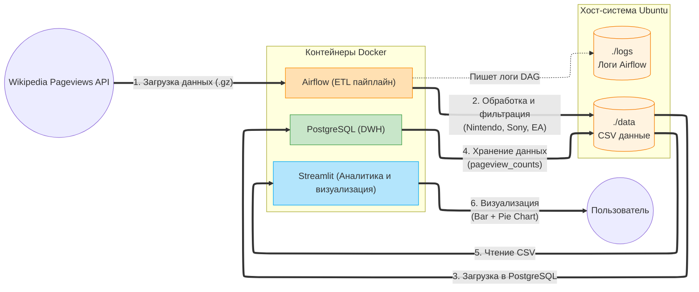


##  Ход выполнения работы

### Дерево проекта 

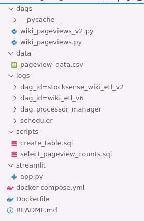

---


### 1. Подготовка окружения

Была развернута виртуальная машина Ubuntu 22.04.

Выполнено клонирование репозитория:

```bash
git clone https://github.com/BosenkoTM/workshop-on-ETL.git
cd workshop-on-ETL/practice/business_case_stocksense_26
```

Созданы рабочие директории:

```bash
mkdir -p dags data logs streamlit
sudo chown -R 50000:0 dags logs data streamlit
sudo chmod -R 775 dags logs data streamlit
```

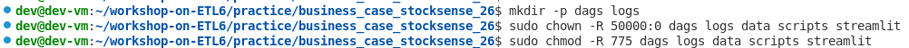

---

### 2. Сборка и запуск Docker-инфраструктуры

Собран кастомный Docker-образ:

```bash
docker build -t custom-airflow:slim-2.8.1-python3.11 .
```

Запуск контейнеров:

```bash
docker compose up -d
```

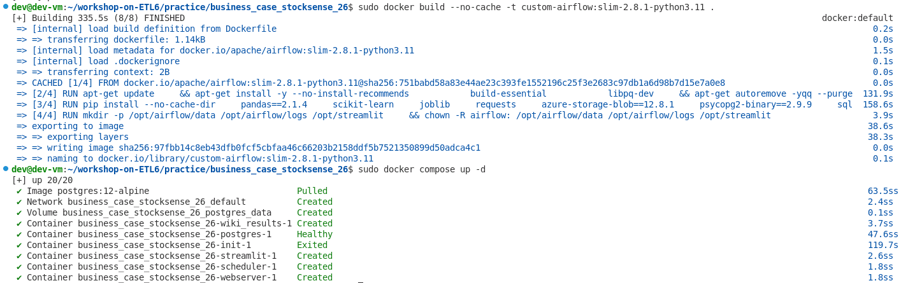

Проверена доступность сервисов:

* Airflow → [http://localhost:8080](http://localhost:8080)
* Streamlit → [http://localhost:8501](http://localhost:8501)
* PostgreSQL → порт 5433

---

### 3. Проверка ETL-пайплайна в Apache Airflow

В интерфейсе Apache Airflow был запущен DAG:

```text
stocksense_wiki_etl_v2
```

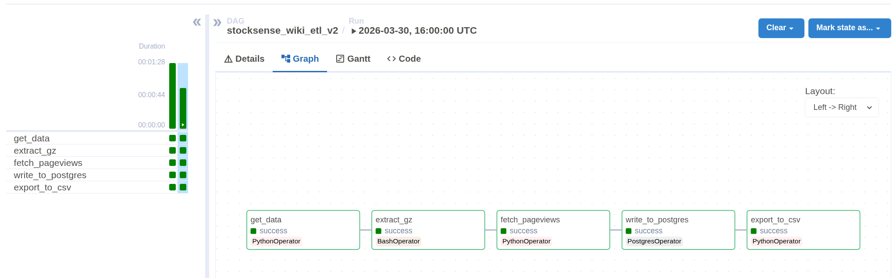

Диаграмма Ганта:

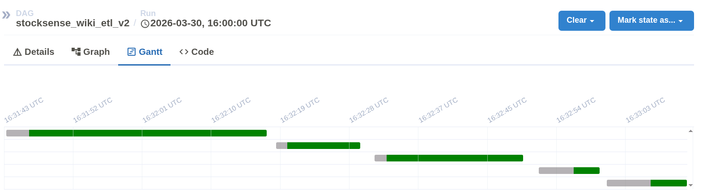

В результате выполнения DAG:

* данные были загружены из Wikipedia Pageviews API
* выполнена фильтрация по заданным страницам
* данные записаны в PostgreSQL
* сформирован CSV-файл
  
---

### 4. Визуализация в Streamlit и проверка работоспособности PostgreSQL

После успешного выполнения ETL-пайплайна была выполнена проверка корректности работы BI-слоя и базы данных.

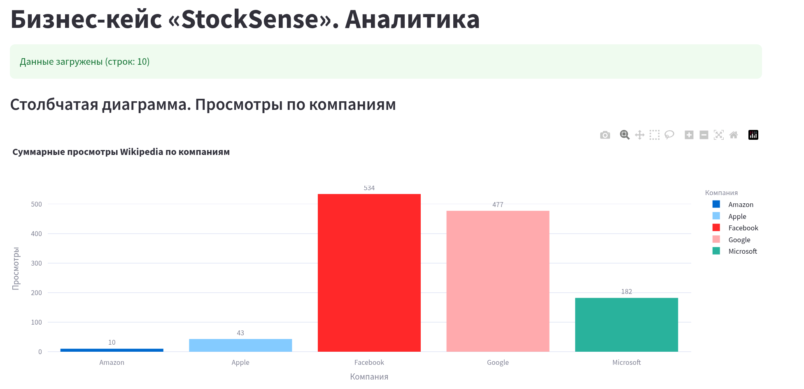 

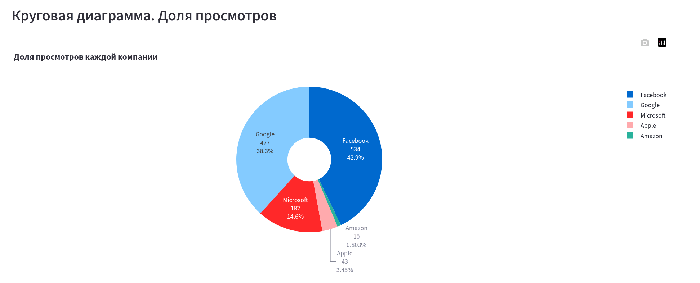 

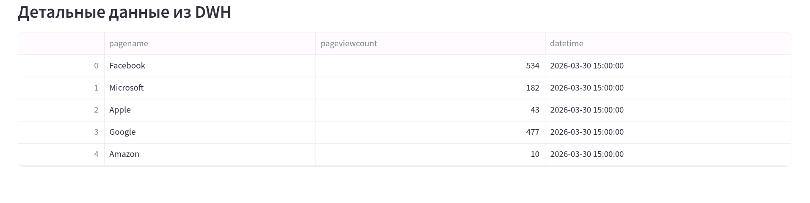

Для проверки работы PostgreSQL был выполнен тест подключения. 

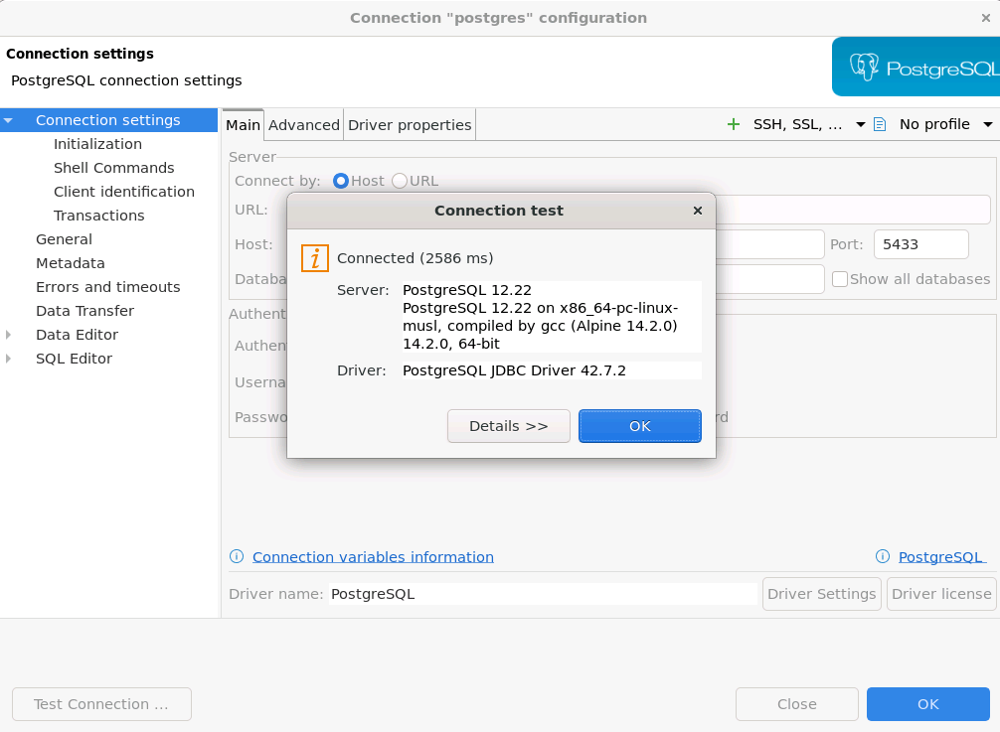

---

### 5. Реализация собственного DAG (вариант 6)
#### Подзадача 1
В DAG были изменены целевые страницы:

```python
TARGET_PAGES = {
    "Nintendo",
    "Sony",
    "Electronic_Arts"
}
```
Реализация собственного DAG

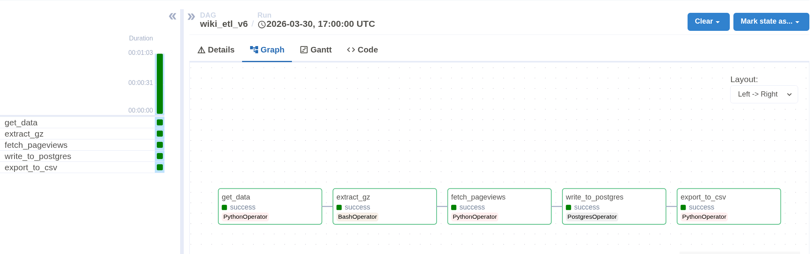

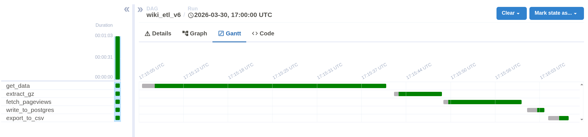

Проверка загрузки в PostgreSQL

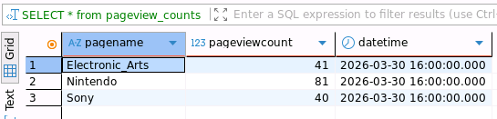

---

#### Подзадача 2 - SQL аналитика

Был выполнен расчет доли просмотров компании Sony от общего числа просмотров:

```sql
SELECT 
    datetime,
    SUM(CASE WHEN pagename = 'Sony' THEN pageviewcount ELSE 0 END) AS sony_views,
    SUM(pageviewcount) AS total_views,
    ROUND(
        SUM(CASE WHEN pagename = 'Sony' THEN pageviewcount ELSE 0 END) * 100.0 
        / SUM(pageviewcount), 
        2
    ) AS sony_percentage
FROM pageview_counts
GROUP BY datetime
ORDER BY datetime;
```

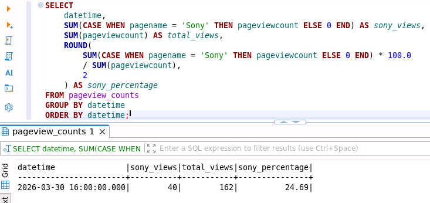

---

#### Подзадача 3

В Streamlit реализован интерактивный дашборд.


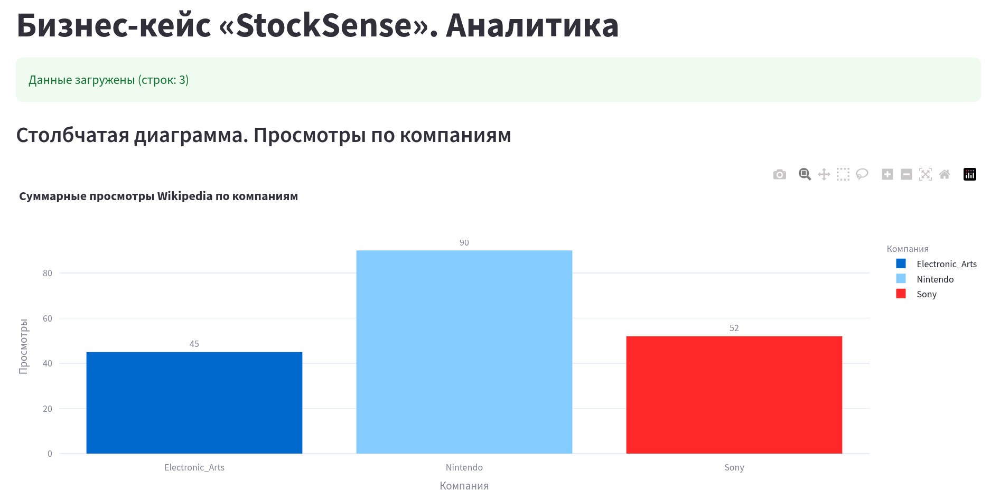

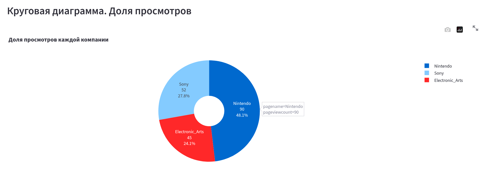

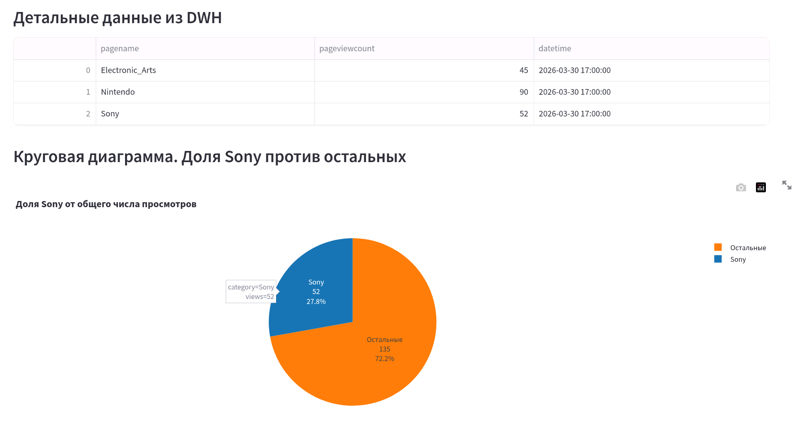

---


## Выводы

В рамках выполнения лабораторной работы был реализован полноценный ETL-конвейер для обработки данных о популярности брендов на основе просмотров страниц Википедии. Были освоены принципы извлечения данных из внешнего источника, их преобразования и загрузки в реляционную базу данных с использованием инструментов оркестрации.

С использованием Apache Airflow был настроен автоматизированный процесс выполнения задач, включающий загрузку данных, их обработку и сохранение. Это позволило обеспечить регулярное обновление данных и их доступность для последующего анализа.

В качестве хранилища данных была использована PostgreSQL, где была создана таблица для хранения информации о просмотрах страниц. Проведенный SQL-анализ позволил определить долю просмотров компании Sony относительно общего числа просмотров (≈27%), что демонстрирует применение данных в аналитических задачах.

Для визуализации результатов был разработан интерактивный дашборд с использованием Streamlit, который позволяет наглядно представить динамику и структуру данных. Визуализация включает столбчатые и круговые диаграммы, что облегчает интерпретацию результатов.

Таким образом, в ходе работы был реализован полный цикл обработки данных: от их получения до визуализации, что соответствует современным подходам к построению аналитических систем.

Наибольшее внимание аудитории привлекает компания Nintendo, на долю которой приходится около 48% всех просмотров. Это может свидетельствовать о наличии значимого информационного повода, такого как выпуск нового продукта, новостные события или активная маркетинговая кампания. Подобный всплеск интереса может рассматриваться как потенциальный индикатор повышенной активности вокруг компании и, в контексте бизнес-анализа, использоваться как сигнал для отслеживания возможных изменений на рынке.

Компания Sony занимает второе место с долей около 28% просмотров. Это говорит о стабильном, но не максимальном уровне интереса со стороны пользователей. В отличие от Nintendo, Sony не демонстрирует резкого роста внимания, что может указывать на отсутствие ярко выраженных инфоповодов в рассматриваемый период. Такая динамика может быть характерна для более устойчивого положения компании на рынке без значительных колебаний интереса.

Electronic Arts показывает наименьший уровень интереса - около 24% от общего числа просмотров. Это может свидетельствовать о сниженной медийной активности или отсутствии значимых событий, связанных с компанией. Низкий уровень просмотров может соответствовать «спокойному» периоду без релизов или новостей, что, в свою очередь, отражается на интересе аудитории.

Дополнительный анализ доли Sony по отношению к остальным компаниям показал, что на неё приходится около 27.8% просмотров, в то время как остальные компании суммарно занимают более 70%. Это подтверждает, что Sony не является доминирующим объектом внимания в текущий момент, а рынок интереса распределён в пользу конкурентов.


